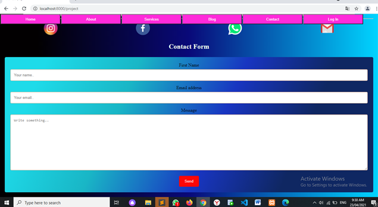

<i>Менің жобамда «login» деген бетте, мектепке тіркелу процесі жүреді. Бұл бетте қолданушы өз аты-жөні, электронды почтасы, құпия сөзі және сүретін енгізіп жібере алады. Бұл жіберілген информация мектептің деректер қорына түседі. 
Бұдан бөлек «project» бетінде қолданушы мектеппен электронды почта арқылы байланыса алады.
</i>

##Registration page:

##Language page:

##Contact page:

